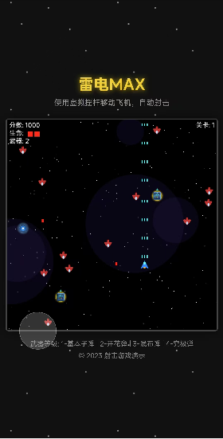

# 雷电MAX

本项目是通过Cursor自动开发的，基于HTML5、CSS和JavaScript (Phaser.js) 的经典雷电风格射击游戏。

## 游戏玩法

1. 使用方向键控制飞机移动
2. 去赢得胜利吧！

## 运行游戏

直接在浏览器中打开 `index.html` 文件即可开始游戏。

## 游戏特点

## 开发技术

- Cursor
- HTML5
- CSS
- JavaScript (Phaser.js)

## 游戏演示

👉 [点击这里在线游玩](https://caojiyuan.github.io/fire)

